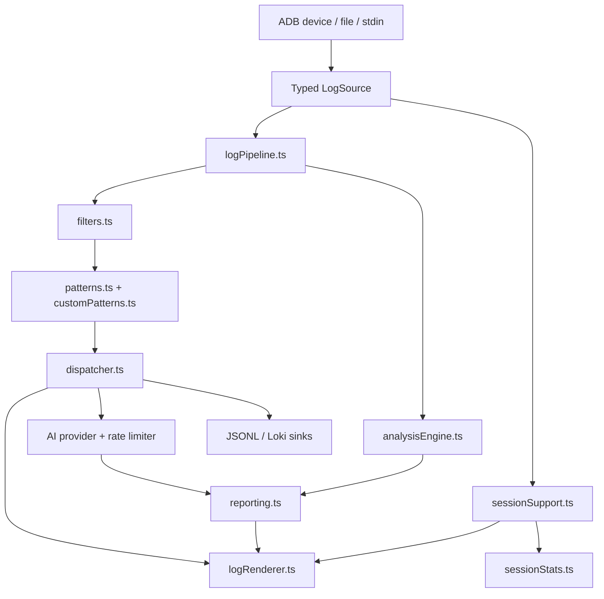

# Architecture

This document describes the current runtime structure of the `logcat-agent` repository after the shared lifecycle, renderer, reporting, and typed-event refactors.

## Subsystems

### CLI and orchestration

- `src/cli/main.ts` wires the first-party commands and loads plugin-provided commands.
- `src/cli/commands/` contains the end-user command implementations.
- `src/cli/logCommandSupport.ts` centralizes option parsing, AI provider creation, and numeric flag normalization.
- `src/cli/sessionSupport.ts` owns shared device selection, shutdown handling, and session completion behavior for long-running commands.

### Sources and ADB integration

- `src/adb/` wraps ADB device discovery, logcat streaming, and wireless-debugging helpers.
- `src/ingest/adbSource.ts`, `src/ingest/fileSource.ts`, and `src/ingest/stdinSource.ts` expose typed `LogSource` implementations for live and offline inputs.

### Pipeline and pattern detection

- `src/pipeline/logPipeline.ts` is the typed event surface between sources, filters, pattern detection, AI dispatch, and sinks.
- `src/pipeline/filters.ts` handles priority and tag filtering.
- `src/pipeline/patterns.ts` and `src/pipeline/customPatterns.ts` provide built-in and JSON-extended pattern registries.
- `src/pipeline/dispatcher.ts` enriches matches and triggers AI work when enabled.

### AI and realtime analysis

- `src/ai/provider.ts` defines the provider contract.
- `src/ai/openaiProvider.ts` and `src/ai/geminiProvider.ts` implement remote providers.
- `src/ai/rateLimiter.ts` deduplicates and bounds concurrent AI work.
- `src/ai/realtime/` contains the proactive analysis engine, anomaly detection, trend analysis, performance monitoring, and typed engine events.

### Rendering, reporting, and stats

- `src/logRenderer.ts` owns user-facing terminal rendering for stream, realtime, and multi-device sessions.
- `src/reporting.ts` converts operational events into renderer-friendly report messages.
- `src/sessionStats.ts` centralizes counters and summaries for single-device, realtime, and multi-device runs.

### Ingestion and retention

- `src/ingest/jsonlSink.ts` and `src/ingest/jsonlExporter.ts` handle daily JSONL export.
- `src/ingest/lokiSink.ts` batches best-effort HTTP pushes to Grafana Loki.
- `src/ingest/retention.ts` enforces age and size retention policies.
- `src/cli/commands/summarize.ts` turns JSONL logs into daily reports.
- `src/cli/commands/cleanup.ts` runs retention manually against an export directory.

### Plugin and protocol surface

- `src/pluginManager.ts` is the extension point for non-core commands.
- `src/sicpPlugin.ts`, `src/tcpCommand.ts`, and `src/protocols/sicp.ts` isolate the Philips SICP/TCP workflow behind that plugin surface.

## Runtime flows

### `stream`

1. Resolve the target device and session lifecycle.
2. Create an ADB-backed source.
3. Run the log pipeline with filters, pattern matching, optional AI, and optional sinks.
4. Render matches, stats, and session summary through the shared renderer.

### `realtime`

1. Resolve device and session lifecycle.
2. Feed log lines into the realtime analysis engine.
3. Emit typed analysis events plus typed report events.
4. Render proactive insights and shutdown summaries through the same renderer/reporting layer as the basic stream flow.

### `stream-all`

1. Enumerate devices and start one source/pipeline bundle per device.
2. Apply throttling and optional per-tag backpressure.
3. Aggregate per-device session metrics.
4. Render multi-device summaries on shutdown.

## Event and control flow

## Current tradeoffs

- The CLI is the primary user interface. The website is documentation/demo oriented rather than a full terminal replacement.
- AI analysis is sampled and budgeted by design. The tool favors bounded cost and responsiveness over exhaustive model calls.
- Remote sinks use retry/backoff but are still best-effort; there is no durable on-disk delivery queue for Loki batches.
- The Philips SICP surface remains product-specific, but it is now isolated behind the plugin system instead of being hard-wired into the core logcat flows.

## Validation surface

- `npm run typecheck` validates the root TypeScript project.
- `npm run lint` validates the CLI/test code and the website TypeScript sources.
- `npm test` covers the pipeline, providers, realtime engine, renderer, stats, plugins, and state handling.
- `npm --prefix website run build` validates the website bundle against the local package.
